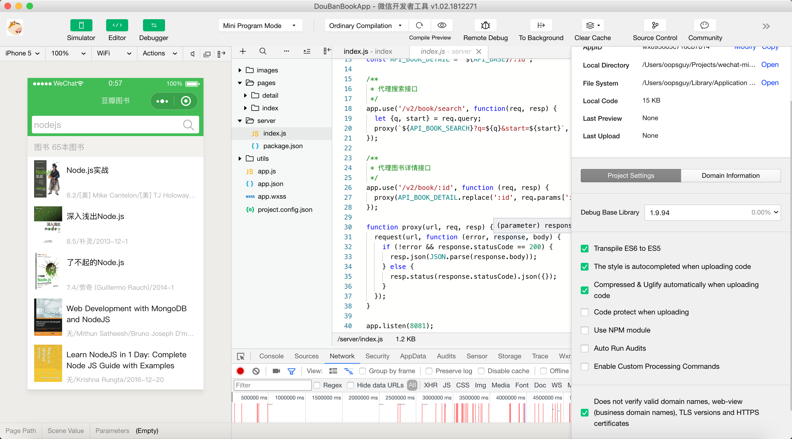
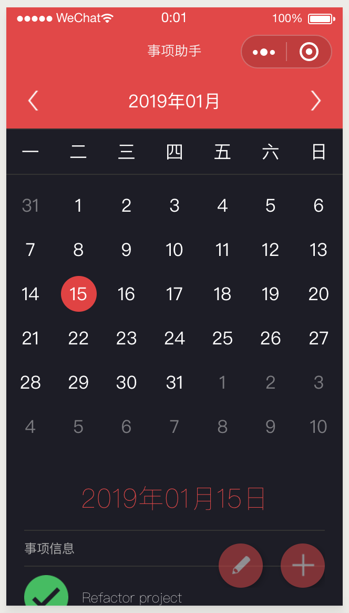
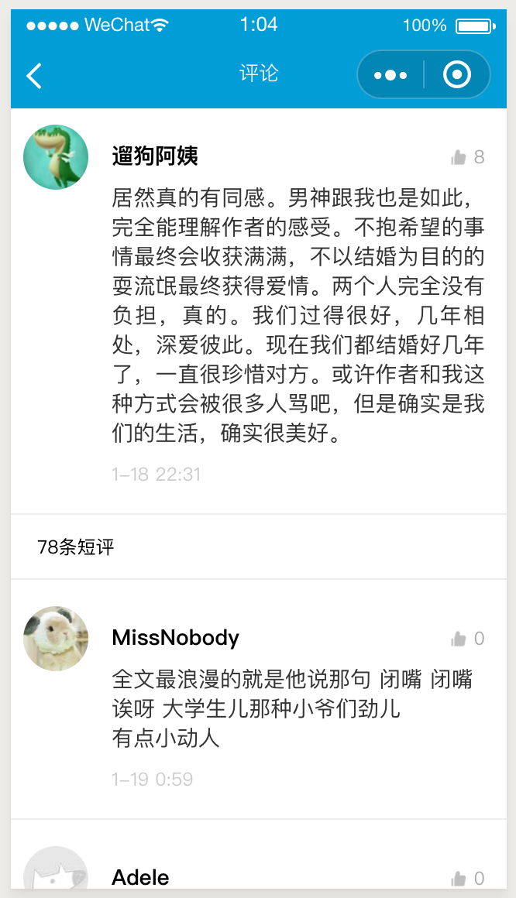
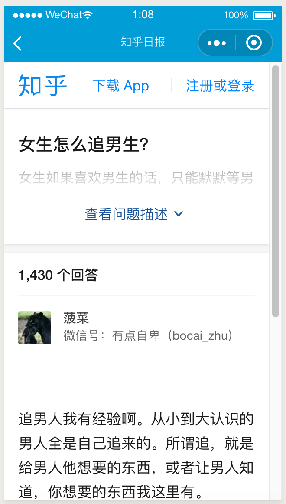
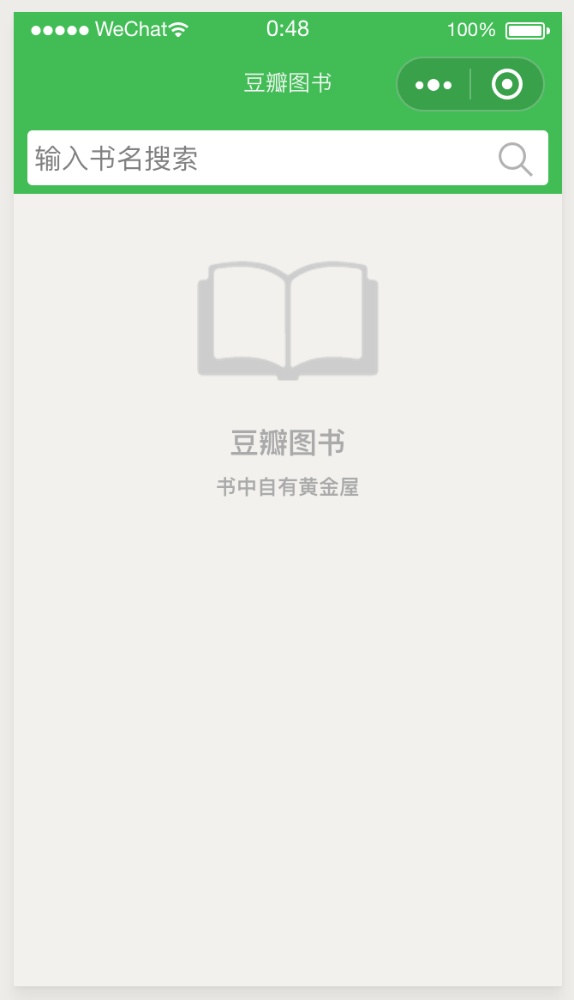
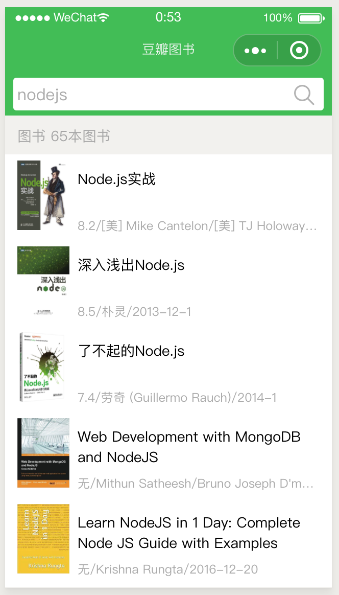
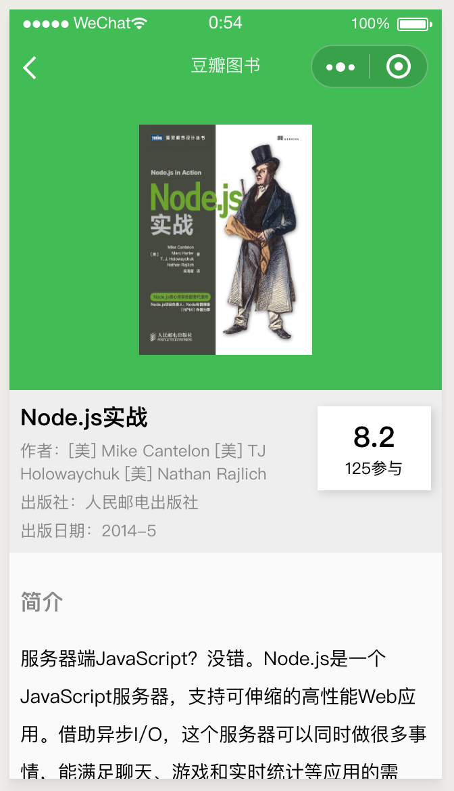

# 微信小程序示例

- [2019-01-14] 最近看回自己的小程序代码，感觉有点乱，代码有些不规范且风格陈旧，因此想抽点时间重构一下。
- [2017-09-09] 本人现在的工作与小程序暂无交集，但还是会偶尔跟进小程序的 API 变更，保持示例能正常运行，同时欢迎大家指出问题。
- [2016-11-03] 微信小程序最近很火热，虽然目前还处于内侧状态，但笔者还是经常看得到许多微信小程序的相关文章，既然它这么火热，自己也想利用空闲时间来尝试学习并做出点东西。笔者刚毕业不久，参加工作也只有 3 个月，实际的开发能力并不能与大牛相比，所做的 DEMO 技术含量比较低，个人目的在于记录下每次学习的过程和与大家分享每一次学习之后的成果。由于工作比较忙，只能抽周末的时间来完善 DEMO，计划中的 DEMO 有几个，以后会慢慢更新。

## 更新日志

- [2019-01-14] 重构豆瓣图书小程序，将旧代码 ES6 化。添加 [`server`](DouBanBookApp/server) 目录，存在豆瓣接口代理服务端程序，可以启动该目录的代码来代理请求豆瓣接口，一定程度上解决微信小程序无法请求豆瓣接口的问题。

    <blockquote>

    ### 使用方式

    豆瓣接口代理服务器代码在 `DouBanBookApp/server` 目录下。

    打开命令行切换到当前目录，如果是第一次运行，请使用 `npm install` 安装依赖。

    之后使用 `node index.js` 运行即可。

    运行之前请确保 `8081` 端口没有被占用，或者你可以修改代码中的端口号。如果使用该服务端代理请求豆瓣接口，请把 `api.js` 中的接口路径指向本服务器地址。

    </blockquote>

- [2018-03-31] 修复知乎日报图片显示问题和空数据报错问题，修复事项助手空数据问题。由于豆瓣接口被官方屏蔽，暂无直接解决方法，可参照网上使用 Nginx 代理方式。
- [2017-09-09] 代码开发的默认 IDE 版本升级到 v1.0.1.170907，为 `wx:for` 添加 `wx:key` 属性，修改事项助手的 ActionSheet 行为，显示声明取消处理事件（即 Promise 的 catch），修改 `bindchange` 为 `bindinput`。
- [2017-08-23] 修复豆瓣图书 Demo 的数据请求失败问题，修改 `request` 的 `header` 中的 `Content-Type` 为 `json` 或者 `html`。

- [2017-02-12] 修改知乎日报案例的图片路径，修复获取知乎图片失败的问题，启动界面的图片获取接口被限制，暂无办法解决！

- [2016-11-23] 由于官方 IDE 更新到了 `0.11.112301` 版本，移除了对 `Promise` 的支持，造成 `事项助手` 不能正常运行，解决此问题，在项目中引入第三方兼容库 [Bluebird](https://github.com/petkaantonov/bluebird) 支持 `Promise`，代码已经整合到项目代码中。

- [2016-11-16] 更新案例 `事项助手` ，配合[微信小程序之 ES6 与事项助手](http://oopsguy.com/2016/11/12/wechat-small-program-es6-matter-assistant/)教程开发，主要是介绍小程序 ES6 开发方法。

- [2016-10-31] 小程序更新到最新版本 [0.10.102800](https://mp.weixin.qq.com/debug/wxadoc/dev/devtools/download.html)，删除之前兼容新注释，`知乎日报`首页的轮播图恢复正常，新增案例计划，初步开发，暂且命名为`事项助手`，其主要功能为日历全月份天数动态展示。

- [2016-10-29] 由于官方不定期升级 IDE，小程序的部分功能被修改和移除，导致之前的项目不能正常运行。现在的代码以最新版 IDE 运行环境为准，即 0.10.102800 版本，可[点击下载](https://mp.weixin.qq.com/debug/wxadoc/dev/devtools/download.html)，虽然修改了代码以适应最新版本的开发环境，但是之前的有些布局和做法已经不再受到官方的支持，所以实际运行效果与效果图中的展示可能存在差异。

## 感谢
`知乎日报`案例上传之后，有比较热心的网友贡献自己的代码修复了很多 bug，非常感谢

- [@jkgeekJack](https://github.com/jkgeekJack)  
  美化部分 UI，增加收藏功能，把主页、主题和收藏页改为单页模式，修复部分图片不能显示的问题，部分代码重构，内容转义字符显示问题修复。

## 相关博文

- [微信小程序之小豆瓣图书](http://oopsguy.com/2016/11/12/wechat-small-program-es6-matter-assistant/)
- [微信小程序之知乎日报](http://oopsguy.com/2016/10/24/wechat-small-program-zhihudaily/)
- [微信小程序之ES6与事项助手](http://oopsguy.com/2016/10/17/weixin-small-program-doubanbook/)

## Demo

### MatterAssistant 事项助手(ES6教程附带例子)

介绍小程序的ES6开发方式，基础到写法，最后给出[事项助手](http://oopsguy.com)作为演示例子，事项助手的功能比较简单，附带日历组件和简单的事项信息存储功能。

### ZhiHuDaliy 知乎日报

上一次的《微信小程序之小豆瓣图书》制作了一个图书的查询功能，只是简单地应用到了网络请求，其他大多数小程序应有的知识。而本次的示例是`知乎日报`，功能点比较多，页面也比上次复杂了许多。在我编写这个DEMO之前，网上已经有很多网友弄出了相同的DEMO，也是非常不错的，毕竟这个案例很经典，有比较完整的API，很值得模仿学习。本次个人的DEMO也算是一次小小的练习吧。

### 豆瓣图书

很简单的一个小例子，使用了两个豆瓣图书的 api：搜索图书和获取图书详情接口。这是自己的第一个微信小程序。

|  |  |  |
| :----: | :----: | :----: |
| 首页 | 列表页 | 详细页 |

## LICENSE

MIT LICENSE
